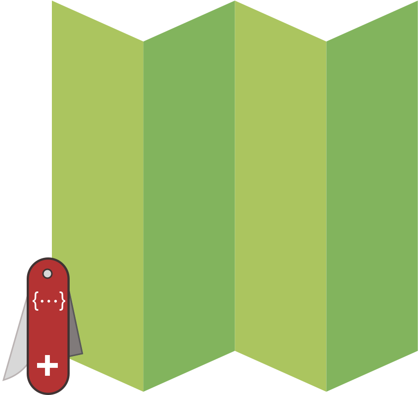

# 🗺 HashRemapper

<p align="center">
  
</p>

> A little lib which maps original keys to the new ones <sup>[*](#features)</sup>

## Installation

Add this line to your application's Gemfile:

```ruby
gem 'hash_remapper'
```

And then execute:

    $ bundle

Or install it yourself as:

    $ gem install hash_remapper

## Features [<a name="features">*</a>]

* maps original keys to the new ones [1](#map)
* auto-ignores all the skipped keys [2](#ignore)
* preprocess a value with a lambda [3](#lambda)
* allows to remap the keys within preprocessing [4](#preprocessing)
* allows to keep data subsets only [5](#subset)
* allows to include data with the original keynames [6](#originals)
* allows to use global context to create composite fields [7](#composite)
* merges values if the key already exists and supports #merge [8](#merge)
* replaces values if the key already exists and doesn't support #merge [9](#replace)
* allows to assign static defaults through lambdas [10](#defaults)
* allows to remap to the deep values within the context [11](#deep)
* allows to create completely new keys [12](#new_keys)

## Usage

```rb
# Having such a Hash
original_hash = {
    test: 42,
    'data' => [
      1,
      2,
      'string!'
    ],
    ignore: :me,
    nested: {
      hash: :data,
      really: {
        deep: true
      }
    },
    recursive: [
      { number: 21 },
      { number: 42 },
      { test: 13 }
    ]
  }
```

## 0: Basic Idea

```rb
HashRemapper.remap(
  { a: 1, b: 2 },
  :a => :hello,
  :b => :world
)

# => { hello: 1, world: 2 }
```

## <a name="map">1</a>: Map original keys to the new ones

```rb
HashRemapper.remap(
  original_hash,        # pass original Hash
  test: :magic_number,  # List old_key => new_key pairs
  'data' => :data,      # including type change if needed
  ignore: :dont_ignore,
  nested: :internal     # values will be just passed to the new keys
)

# =>
# {
#   magic_number: 42,
#   data: [1, 2, 'string!'],
#   dont_ignore: :me,
#   internal: { hash: :data, really: { deep: true } },
#   recursive: [ { number: 21 }, { number: 42 }, { test: 13 } ]
# }
```

## <a name="ignore">2</a>: Auto-ignore all the skipped keys

```rb
HashRemapper.remap(
  original_hash,
  test: :magic_number
)

# =>
# {
#   magic_number: 42
# }

HashRemapper.remap(
  original_hash,
  false, 					# a flag to pass through the original key => value pairs
  test: :magic_number
)

# =>
#  {
#    "data" => [1, 2, "string!"],
#    :ignore => :me,
#    :magic_number => 42,
#    :nested => {:hash=>:data, :really=>{:deep=>true}}
#    :recursive => [ { number: 21 }, { number: 42 }, { test: 13 } ]
#  }
```

## <a name="lambda">3</a>: Preprocess the values with lambdas

```rb
HashRemapper.remap(
  original_hash,
  test: ->(_, __) { [:test, 21] } # do whatever you want and return "key: value" Array
)

# =>
# {
#   test: 21
# }
```

## <a name="preprocessing">4</a>: Remap keys within preprocessing

```rb
HashRemapper.remap(
  original_hash,
  test: ->(data, _) { [:magic_number, data.to_s] }
)

# =>
# {
#   magic_number: '42'
# }
```

## <a name="subset">5</a>: Keep data subsets only

```rb
HashRemapper.remap(
  original_hash,
  'data' => ->(data, _) { ['data', data[0..1]] },
)

# =>
# {
#   'data' => [1, 2]
# }
```

## <a name="originals">6</a>: Include data with the original keyname

```rb
HashRemapper.remap(
  original_hash,
  test: :magic_number,
  ignore: :ignore
)

# =>
# {
#   magic_number: 42,
#   ignore: :me
# }
```

## <a name="composite">7</a>: Use global context to create composite fields

```rb
HashRemapper.remap(
  original_hash,
  test: ->(data, context) { [:magic_number, data + context['data'][1]] }
)

# =>
# {
#   magic_number: 44
# }
```

## <a name="merge">8</a>: Merges values

```rb
HashRemapper.remap(
  original_hash,
  test: ->(_, __) { [:magic_number, { one: 1 }] },
  whatever: ->(_, __) { [:magic_number, { two: 2 }] }
)

# =>
# {
#   magic_number: { one: 1, two: 2 }
# }
```

## <a name="replace">9</a>: Replace values if the key already exists and doesn't support `#merge`

```rb
HashRemapper.remap(
  original_hash,
  test: ->(_, __) { [:magic_number, 42] },
  whatever: ->(_, __) { [:magic_number, 21] }
)

# =>
# {
#   magic_number: 21
# }
```

## <a name="defaults">10</a>: Assign static defaults

```rb
HashRemapper.remap(
  original_hash,
  test: ->(_, __) { [:magic_number, 21] }
)

# =>
# {
#   magic_number: 21
# }
```

## <a name="deep">11</a>: Remap to the deep values

```rb
# INFO: For advanced usage see the specs!
HashRemapper.remap(
  original_hash,
  test: [:magic_bool, { path: 'nested.really.deep' }]]
)

# =>
# {
#   magic_bool: true
# }

HashRemapper.remap(
  original_hash,
  test: [:magic_numbers, {path: 'recursive.*.number', strict: false}]]
)

# =>
# {
#   magic_numbers: [21, 42, nil]
# }
```

## <a name="new_keys">12</a>: Create completely new keys

```rb
HashRemapper.remap(
  original_hash,
  test: :magic_number,
  absolutely_new_key: ->(_, __) { [:absolutely_new_key, 'shiny new value'] }
)

# =>
# {
#   magic_number: 42,
#   absolutely_new_key: 'shiny new value'
# }
```

## Development

After checking out the repo, run `bin/setup` to install dependencies. Then, run `rake spec` to run the tests. You can also run `bin/console` for an interactive prompt that will allow you to experiment.

To install this gem onto your local machine, run `bundle exec rake install`. To release a new version, update the version number in `version.rb`, and then run `bundle exec rake release`, which will create a git tag for the version, push git commits and tags, and push the `.gem` file to [rubygems.org](https://rubygems.org).

## Contributing

Initial version of this lib was written in pair with [@bronislav](https://github.com/bronislav), so thank him for the invaluable contribution and help.

Bug reports and pull requests are welcome on GitHub at https://github.com/smileart/hash_remapper. This project is intended to be a safe, welcoming space for collaboration, and contributors are expected to adhere to the [Contributor Covenant](http://contributor-covenant.org) code of conduct.

## License

The gem is available as open source under the terms of the [MIT License](http://opensource.org/licenses/MIT).

## Code of Conduct

Everyone interacting in the HashRemapper project’s codebase, issue trackers, chat rooms and mailing lists is expected to follow the [code of conduct](https://github.com/smileart/hash_remapper/blob/master/CODE_OF_CONDUCT.md).
